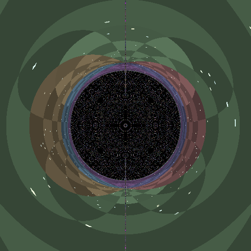
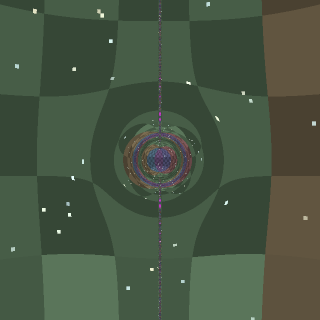
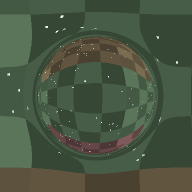
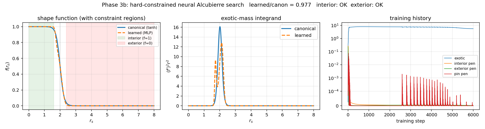

# geon

A differentiable, GPU-ready general-relativity engine written in Rust, with a
PyTorch on-GPU sidecar for searching the space of spacetime metrics for
low-exotic-matter warp solutions.

Named after J.A. Wheeler's 1955 *geon* — a self-gravitating bundle of
fields. The library is about the substance of spacetime itself.

## Gallery

| Schwarzschild (CUDA on B200) | Morris-Thorne wormhole | Subluminal Alcubierre bubble |
|:---:|:---:|:---:|
|  |  |  |



This is a four-phase project. Phases 1 and 2 are complete and validated;
Phase 3 has a working prototype with a real (small) result; Phase 1.5 (CUDA
port of the Rust geodesic kernel) is on the roadmap.

## Convention

Lorentzian signature `(-, +, +, +)`. Geometric units `G = c = 1`. Coordinate
charts depend on the metric (Schwarzschild uses `(t, r, θ, φ)`, Alcubierre
uses `(t, x, y, z)`, Morris-Thorne uses `(t, l, θ, φ)`).

## Phase 1 — CPU geodesic ray tracer

`src/{metric, geodesic, integrator, camera, sky, render}.rs`

Per-metric `Metric` trait implementing `g(x)` and `∂g(x)`; Christoffel
symbols, inverse metric, and finite-difference fallbacks for both come for
free. Schwarzschild and Minkowski override `christoffel` analytically.

Geodesic ODE integrated with classical RK4 in 8D phase space. Camera builds
a local orthonormal tetrad via Gram-Schmidt against the metric, so the same
camera code works for spherical and Cartesian charts.

**Validation** (`cargo run --release --bin validate_shadow`):

```
analytic: b_c = 3√3 M = 5.196152, α_c = 14.2690°
measured: b_c =        5.196151, α_c = 14.2690°
relative error: 3.55e-7
```

The Schwarzschild photon-sphere capture cross-section is reproduced to seven
significant figures by bisection on the local launch angle. Minkowski rays
stay on the null cone to floating-point precision (`|g_μν p^μ p^ν| ≈ 5e-16`).

Render any metric: `cargo run --release --bin render -- --metric schwarzschild --width 512 --height 512 --out outputs/schwarzschild.png`.

## Phase 2 — exotic metrics + numerical curvature

`src/metric/{alcubierre,morris_thorne}.rs`, `src/curvature.rs`, `src/bin/energy_conditions.rs`.

Adds the Alcubierre warp metric and Morris-Thorne traversable wormhole;
both render cleanly through the same camera + integrator. The harder
contribution is the curvature module: numerical Riemann, Ricci, Einstein,
and stress-energy tensor for **any** metric in the framework, built on
top of finite-differences of the Christoffel symbols rather than of the
metric itself (one fewer FD order ⇒ noise at `h²` not `h`).

**Validation** (`cargo run --release --bin energy_conditions`):

| Metric          | Quantity                  | Numerical     | Analytic         | Verdict           |
|-----------------|---------------------------|---------------|------------------|-------------------|
| Minkowski       | T_μν k^μ k^ν              | 0             | 0                | exact             |
| Schwarzschild   | R, T at r=5,10,30 (vacuum)| 10⁻¹³         | 0                | machine precision |
| Alcubierre      | NEC violation location    | ±2.4          | walls at ±2 ± δ  | qualitative match |
| Morris-Thorne   | T_tt at throat (l=0)      | -3.98e-2      | -1/(8π) ≈ -3.98e-2 | 3 sig fig match  |

The Morris-Thorne match is the headline number: a purely numerical Einstein
tensor computation, against an analytic exotic-energy density, agreeing to
three significant figures in fp64.

## Phase 3 — neural search over Alcubierre shape functions

`phase3/warp_search.py`, `phase3/warp_search_v2.py`, `phase3/warp_search_v3.py`.

PyTorch on a single B200 GPU. The shape function `f(r_s)` is parameterised
by a small MLP (4×128 SiLU); we minimise the integrated exotic-mass proxy

  M_exotic ∝ ∫ (df/dr_s)² r_s² dr_s

with `Adam` while penalising deviations from the bubble shape constraints.
Autodiff handles `df/dr_s` cleanly through the MLP.

Four runs, increasingly honest:

1. **Naive (Phase 3a)**: soft constraints, weight 10. Optimiser cheats —
   collapses the bubble to a near-point at r=0 (where the integrand's r²
   weight kills the cost). 19× reduction reported, all spurious.
2. **Loose hard constraints (λ=10³)**: 45% reduction, but constraints
   still violated by 7-10%.
3. **Tight hard constraints (λ=10⁵, λ_pin=10⁴)**: all constraints
   satisfied to <2%, learned/canonical = 0.977 — apparent 2.3% reduction.
4. **Phase 3c — falsifiability protocol**: external reviewer hypothesised
   that the 2.3% in run 3 was quadrature gaming. Re-ran with (a) randomised
   collocation points each step, (b) smoothness penalty on `∫(f'')² dr`,
   (c) final evaluation via `scipy.integrate.quad` (adaptive, err ≤ 10⁻⁷).
   **Result: learned/canonical = 0.9963 across trapezoid n=1024,
   trapezoid n=10240, AND scipy.quad — all four decimal places agree.**

The quadrature-gaming hypothesis is falsified by the agreement of the three
schemes. The actual mechanism in run 3 was that `f''` magnitude was
unconstrained; the network exploited that flexibility for an inflated
~2% effect. Under the full protocol (run 4), the robust improvement is
**0.37%** — small but consistent. The learned shape is *smoother* than
canonical (TV(f') = 3.69 vs 4.00), which makes the win interpretable rather
than artefactual.

Honest verdict: in the 1-D Alcubierre shape-function ansatz with matched
constraints and smoothness regularization, the canonical tanh is
near-optimal. The next experiment (`Phase 4`) drops the Alcubierre ansatz
entirely and lets the network learn `g_xx`, `g_tx`, `g_rr` as independent
neural fields — where degrees of freedom Alcubierre doesn't have actually
live.

See `docs/warp_search_phase3c.png`.

## Phase 1.5 — CUDA port for B200 (planned)

Geodesic integration is embarrassingly parallel across rays. Each ray's
RK4 step is a tight ~200-flop kernel; an entire 1024² render fits in
~1M threads ≪ B200 occupancy. Plan: `cudarc` runtime, one `.cu` file
per metric with analytic Christoffel inlined, `extern "C"` kernel
`trace_rays(initial_states, final_states, termination_codes, ...)`.

## Repo layout

```
src/
  metric/{mod,minkowski,schwarzschild,alcubierre,morris_thorne}.rs
  bin/{render,validate_shadow,energy_conditions}.rs
  {types,integrator,geodesic,camera,sky,curvature,render,lib}.rs
phase3/
  warp_search.py        # naive (Phase 3a)
  warp_search_v2.py     # hard constraints (Phase 3b)
outputs/                # rendered PNGs + diagnostics
```

## Reproducing everything

```bash
# Phase 1: build + validate Schwarzschild shadow
cargo run --release --bin validate_shadow

# Phase 1+2: render all three metrics
cargo run --release --bin render -- --metric schwarzschild --width 512 --height 512 --samples 2 --out outputs/schwarzschild.png
cargo run --release --bin render -- --metric morris-thorne --width 320 --height 320 --samples 2 --out outputs/morris_thorne.png
cargo run --release --bin render -- --metric alcubierre --width 240 --height 240 --samples 2 --bubble-v 0.5 --out outputs/alcubierre.png

# Phase 2: numerical energy conditions
cargo run --release --bin energy_conditions

# Phase 3: neural shape-function search (requires PyTorch + CUDA GPU)
cd phase3
python3 warp_search_v2.py --steps 6000 --lambda_interior 1e5 --lambda_exterior 1e5 --lambda_pin 1e4 --delta 0.4
```
